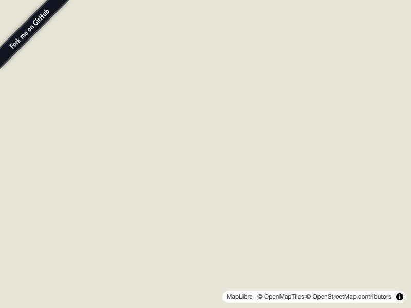

# @geolonia/maplibre-fork-me-control

MapLibre GL JS plugin to add GitHub's "Fork me" ribbon to the map.



## Install

```
npm install @geolonia/maplibre-fork-me-control
```

## Usage

```js
import maplibregl from "maplibre-gl";
import { ForkMeControl } from "@geolonia/maplibre-fork-me-control";

const map = new maplibregl.Map({
  container: "map",
  style: "https://tile.openstreetmap.jp/styles/maptiler-basic-ja/style.json",
});

map.addControl(
  new ForkMeControl({
    url: "https://github.com/geolonia/maplibre-fork-me-control",
  }),
);
```

## Options

| Option | Type | Default | Description |
|---|---|---|---|
| `url` | `string` | **(required)** | Link URL (e.g. GitHub repository) |
| `position` | `"top-left" \| "top-right"` | `"top-left"` | Ribbon placement |
| `image` | `string` | GitHub ribbon PNG | Custom ribbon image URL |
| `alt` | `string` | `"Fork me on GitHub"` | Alt text for the image |

### Top-right example

```js
map.addControl(
  new ForkMeControl({
    url: "https://github.com/geolonia/maplibre-fork-me-control",
    position: "top-right",
  }),
);
```

## License

MIT
